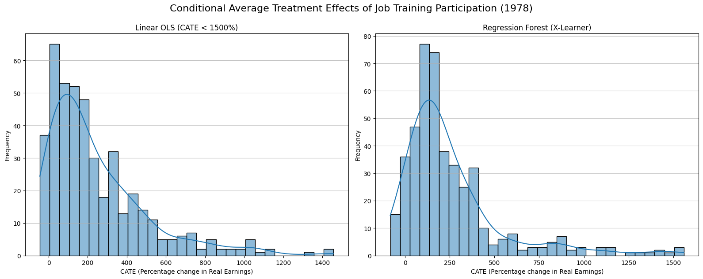

# Estimating the Causal Treatment Effect of Job Training Programs on Participant Earnings: Evidence from the U.S.

## Repository Link

[[Link to CausalInference_ML](https://github.com/lefie1231/CausalInference_ML)]

## Description

Job training programs such as the National Supported Work (NSW) Demonstration were designed the help disadvantaged workers in the U.S. find new jobs and increase their income. The sample from the dataset used in this project only includes the male subpopulation.

To estimate treatment effects, I will fit and compare a regression model and a causal forest to calculate both the average and conditional treatment effect on worker's real earnings. Finally, I will visually inspect the heterogeneity in treatment effects.

### Task Type

1. Calculation of ATE & CATE under the best regression model: Linear OLS 
2. Calculation of ATE & CATE under the best forest model: Regression forest (X-Learner) 
3. Plotting and interpreting multiple plots of treatment heterogeneity

### Results Summary

#### Best Model Performance
- **Best Model:** Regression forest model, AIPW used for calculation of ATE, X-Learner used for calculation of CATE
- **Evaluation Metric:** R-Score (based on R-loss)
- **Final Performance:** R-Score = 0.02118 

#### Model Comparison
- **Baseline Performance:** OLS regression model based on a linear structural model ("Linear OLS"), AIPW used for calculation of ATE 
- **Improvement Over Baseline:** Although no numerical comparison is made, the forest model likely captures treatment effects better than the baseline model, because the latter is constrained by its linear functional form.

#### Key Insights
- **Results:** Overall, average treatment effects are statistically significant and positive for both models, but there are also some participants that experience negative treatment effects. In general, participants with zero pre-treatment earnings, black participants, aswell as participants with more than 10 years of education and more than 26 years of age, benefit relatively more than their respective other groups. 
- **Model Limitations:** The dataset included many zero values that had to be addressed. Other statistical models beyond the scope of this project could handle these more effectively than a simple log(y+1) transformation. Additionally, the dataset only included male participants and a large majority of Black participants, which limits external validity. The results of this project may not generalize to other populations.
- **Business Impact:** Overall, job training can be a very effective tool for increasing participants' earnings. However, it does not necessarily reach the most disadvantaged workers. Black participants are found to benefit relatively more, which is encouraging, but those who were unemployed or had zero pre-treatment earnings, had fewer years of education, or were younger (and thus likely had less opportunity to build a formal career) did not benefit more compared to their respective counterparts.
The content of the NSW job training program may therefore need to be better tailored to the needs of these groups.

## Documentation

1. **[Literature Review](0_LiteratureReview/README.md)**
2. **[Dataset Characteristics](1_DatasetCharacteristics/exploratory_data_analysis.ipynb)**
3. **[Baseline Model](2_BaselineModel/baseline_model.ipynb)**
4. **[Model Definition and Evaluation](3_Model/model_definition_evaluation.ipynb)**
5. **[Presentation](4_Presentation/README.md)**

## Cover Image

